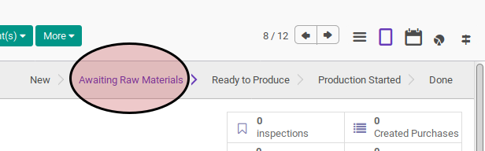
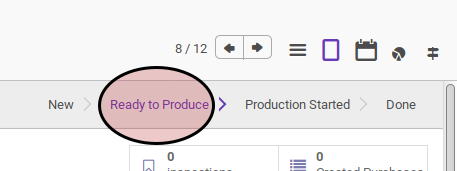

# Cek Ketersediaan Raw Material

## A. INPUT

* Data manufacturing order yang akan dikonfirmasi harus memiliki status **Awaiting Raw Material**.

## B. LANGKAH KERJA

1. Buka menu **Manfacturing -> Manufacturing -> Manufacturing Order**. Abaikan jika sudah berada pada menu yang dimaksud.
2. Buka data manufacturing order yang akan dikonfirmasi. Abaikan jika data sudah terbuka.
3. Klik tombol **Check Availability** pada bagian atas-kiri form.

## C. OUTPUT

* Apabila semua raw material sudah tersedia maka status manufacturing order akan berubah menjadi **Ready To Produce**.

* Apabila semua raw material belum tersedia tersedia semua maka status manufacturing order akan tetap **Awaiting Raw Material**.

