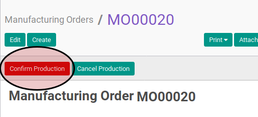
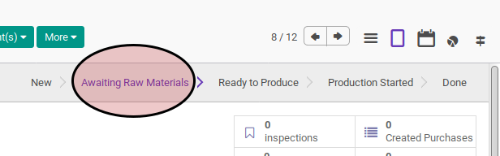

# Konfirmasi Manufacturing Order

## A. INPUT

* Data manufacturing order yang akan dikonfirmasi harus memiliki status **New**

## B. LANGKAH KERJA

1. Buka menu **Manfacturing -> Manufacturing -> Manufacturing Order**. Abaikan jika sudah berada pada menu yang dimaksud.
2. Buka data manufacturing order yang akan dikonfirmasi. Abaikan jika data sudah terbuka.
3. Klik tombol **Confirm Production** pada bagian atas-kiri form.

## C. OUTPUT

* Status manufacturing order akan berubah menjadi **Awaiting Raw Material**.

