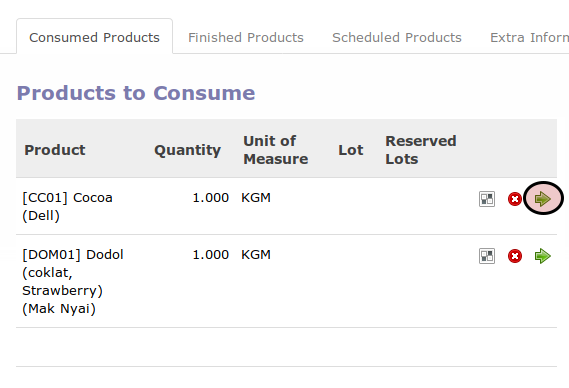
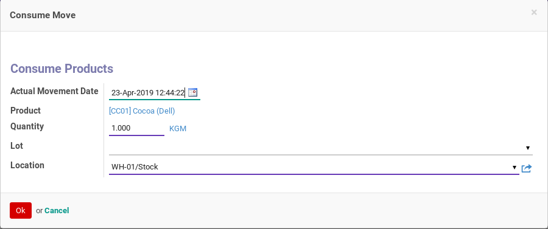
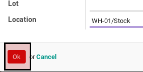

# Konsumsi Raw Material

## A. INPUT

* Data manufacturing order yang akan dikonsumsi harus memiliki status **Production Started**.

## B. LANGKAH KERJA

1. Buka menu **Manfacturing -> Manufacturing -> Manufacturing Order**. Abaikan jika sudah berada pada menu yang dimaksud.
2. Buka data manufacturing order yang akan dikonfirmasi. Abaikan jika data sudah terbuka.
3. Buka tab **Consumed Product**.
4. <a name="l4">Klik</a> icon **Panah Ke Kanan** pada data bahan baku yang akan dikonsumsi.

5. Pop-up **Consume Move** akan muncul

6. Isi **Actual Movement Date** pada pop-up **Consume Move**. Harus diisi.
7. Isi **Quantity** pada pop-up **Consume Move**. Harus diisi.
8. Klik tombol **Ok** pada bagian bawah-kiri pop-up **Consume Move**

9. Ulangi [langkah ke-4](#l4) untuk setiap bahan baku yang akan dikonsumsi.

## C. OUTPUT

*(Tidak ada instruksi khusus)*
