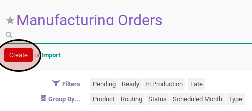
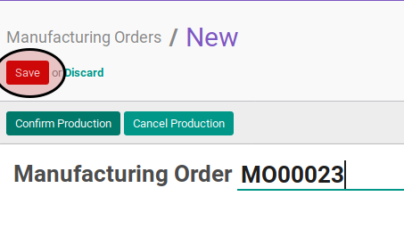
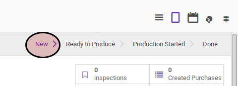

# Membuat Manufacturing Order

## A. INPUT

*(tidak ada instruksi khusus)*

## B. LANGKAH KERJA

1. Buka menu **Manfacturing -> Manufacturing -> Manufacturing Order**
2. Klik tombol **Create** pada bagian atas-kiri form.

3. Pilih **Type**. Harus diisi.
4. Pilih **Product**. Harus diisi.
5. Isi **Product Quantity**. Harus diisi.
6. Isi **Product Quantity UoM**. Harus diisi.
7. Isi **Schedule Date** Harus diisi.
8. Pilih **Bill of Material**. Harus diisi.
9. Pilih **Responsible**. Harus diisi.
10. Isi **Source Document**. Tidak harus diisi.
11. Pilih **Operating Unit**. Tidak harus diisi.
12. Pilih **Raw Material Location**. Harus diisi.
13. Aktifkan **Auto Create Procurement Group** jika dibutuhkan.
14. Pilih **Raw Material Procurement Group**. Tidak harus diisi.
15. Pilih **Finished Products Location**. Harus diisi.
16. Aktifkan **Use Raw Material Procurement Group** jika dibutuhkan.
17. Pilih **Finished Good Procurement Group**. Tidak harus diisi.
18. Klik tombol **Save** pada bagian atas-kiri form.

## C. OUTPUT

* Data manufacturing order akaan terbuat dengan status **New**

