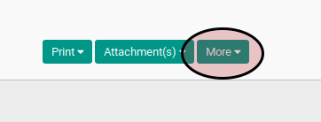
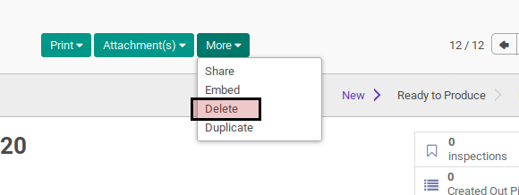
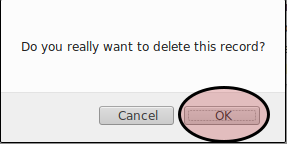

# Menghapus Manufacturing Order

## A. INPUT

* Data manufacturing order yang akan dihapus harus memiliki status **New**

## B. LANGKAH KERJA

1. Buka menu **Manfacturing -> Manufacturing -> Manufacturing Order**. Abaikan jika sudah berada pada menu yang dimaksud.
2. Buka data manufacturing order yang akan dihapus. Abaikan jika data sudah dibuka.
3. Klik tombol **More** pada bagian atas-tengah form.

4. Klik tombol **Delete** pada drop-down yang muncul dari tombol **More**.

5. Klik tombol **Ok** pada dialog konfirmasi penghapusan.

## C. OUTPUT

* Data manufacturing order akan terhapus.
