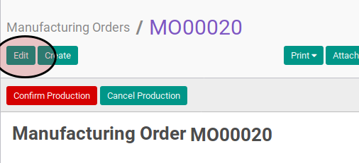

# Memodifikasi Manufacturing Order

## A. INPUT

* Data manufacturing order yang akan dimodifikasi harus memiliki status **New**

## B. LANGKAH KERJA

1. Buka menu **Manfacturing -> Manufacturing -> Manufacturing Order**. Abaikan jika sudah berada pada menu yang dimaksud.
2. Buka data manufacturing order yang akan dimodifikasi. Abaikan jika data sudah dibuka.
3. Klik tombol **Edit** pada bagian atas-kiri form.

4. Pilih dan sesuaikan **[Type](./penjelasan.md#field-type)** jika dibutuhkan. Harus diisi.
5. Pilih dan sesuaikan **[Product](./penjelasan.md#field-product)** jika dibutuhkan. Harus diisi.
6. Isi dan sesuaikan **[Product Quantity](./penjelasan.md#field-product-qty)** jika dibutuhkan. Harus diisi.
7. Isi dan sesuaikan **[Product Quantity UoM](./penjelasan.md#field-product-qty-uom)** jika dibutuhkan. Harus diisi.
8. Isi dan sesuaikan **[Schedule Date](./penjelasan.md#field-scheduled-date)** jika dibutuhkan. Harus diisi.
9. Pilih dan sesuaikan **[Bill of Material](./penjelasan.md#field-bom)** jika dibutuhkan. Harus diisi.
10. Pilih dan sesuaikan **[Responsible](./penjelasan.md#field-responsible)** jika dibutuhkan. Harus diisi.
11. Isi dan sesuaikan **[Source Document](./penjelasan.md#field-source-document)** jika dibutuhkan. Tidak harus diisi.
12. Pilih dan sesuaikan **[Operating Unit](./penjelasan.md#field-operating-unit-ids)** jika dibutuhkan. Tidak harus diisi.
13. Pilih dan sesuaikan **[Raw Material Location](./penjelasan.md#field-raw-materials-location)** jika dibutuhkan. Harus diisi.
14. Aktifkan **[Auto Create Procurement Group](./penjelasan.md#field-auto-create-procurement)** jika dibutuhkan.
15. Pilih dan sesuaikan **[Raw Material Procurement Group](./penjelasan.md#field-raw-material-procurement)** jika dibutuhkan. Tidak harus diisi.
16. Pilih dan sesuaikan **[Finished Products Location](./penjelasan.md#field-finished-products-location)** jika dibutuhkan. Harus diisi.
17. Aktifkan **[Use Raw Material Procurement Group](./penjelasan.md#field-use-raw-procurement)** jika dibutuhkan.
19. Pilih dan sesuaikan **[Finished Good Procurement Group](./penjelasan.md#field-finished-procurement)** jika dibutuhkan. Tidak harus diisi.
19. Klik tombol **Save** pada bagian atas-kiri form.

## C. OUTPUT

* Data manufacturing order berubah sesuai dengan perubahan yang dilakukan.
