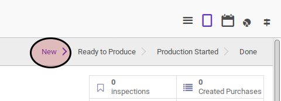

# Memodifikasi Manufacturing Order

## A. INPUT

* Data manufacturing order yang akan dimodifikasi harus memiliki status **New**

## B. LANGKAH KERJA

1. Buka menu **Manfacturing -> Manufacturing -> Manufacturing Order**. Abaikan jika sudah berada pada menu yang dimaksud.
2. Buka data manufacturing order yang akan dimodifikasi. Abaikan jika data sudah dibuka.
3. Klik tombol **Edit** pada bagian atas-kiri form.

4. Pilih dan sesuaikan **Type** jika dibutuhkan. Harus diisi.
5. Pilih dan sesuaikan **Product** jika dibutuhkan. Harus diisi.
6. Isi dan sesuaikan **Product Quantity** jika dibutuhkan. Harus diisi.
7. Isi dan sesuaikan **Product Quantity UoM** jika dibutuhkan. Harus diisi.
8. Isi dan sesuaikan **Schedule Date** jika dibutuhkan. Harus diisi.
9. Pilih dan sesuaikan **Bill of Material** jika dibutuhkan. Harus diisi.
10. Pilih dan sesuaikan **Responsible** jika dibutuhkan. Harus diisi.
11. Isi dan sesuaikan **Source Document** jika dibutuhkan. Tidak harus diisi.
12. Pilih dan sesuaikan **Operating Unit** jika dibutuhkan. Tidak harus diisi.
13. Pilih dan sesuaikan **Raw Material Location** jika dibutuhkan. Harus diisi.
14. Aktifkan **Auto Create Procurement Group** jika dibutuhkan.
15. Pilih dan sesuaikan **Raw Material Procurement Group** jika dibutuhkan. Tidak harus diisi.
16. Pilih dan sesuaikan **Finished Products Location** jika dibutuhkan. Harus diisi.
17. Aktifkan **Use Raw Material Procurement Group** jika dibutuhkan.
19. Pilih dan sesuaikan **Finished Good Procurement Group** jika dibutuhkan. Tidak harus diisi.
19. Klik tombol **Save** pada bagian atas-kiri form.

## C. OUTPUT

* Data manufacturing order berubah sesuai dengan perubahan yang dilakukan.
