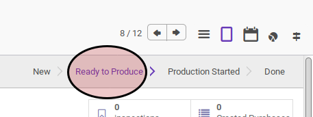
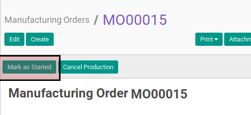
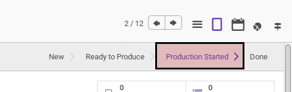

# Memulai Manufacturing Order

## A. INPUT

* Data manufacturing order yang akan dimulai harus memiliki status **Ready To Produce**.

## B. LANGKAH KERJA

1. Buka menu **Manfacturing -> Manufacturing -> Manufacturing Order**. Abaikan jika sudah berada pada menu yang dimaksud.
2. Buka data manufacturing order yang akan dimulai. Abaikan jika data sudah terbuka.
3. Klik tombol **Mark As Started** pada bagian atas-kiri form.

## C. OUTPUT

* Status manufacturing order akan berubah menjadi **Production Started**.

