# Penjelasan Manufacturing Order

Informasi pada Manufacturing Order dibagi menjadi beberapa area, diantaranya:
* [Header](#bagian-header)
* [Tab Consumend Product](#tab-consumed-product)
* [Tab Finished Product](#tab-finished-product)
* [Tab Scheduled Product](#tab-scheduled-product)
* [Tab Extra Information](#tab-extra-info)
* [Tab Workflow Policy](#tab-workflow-policy)
* [Tab Notes](#tab-notes)
* [Tab Byproduct](#tab-byproduct)
* [Tab Applied Cost](#tab-applied-cost)

### <a name="bagian-header">HEADER</a>

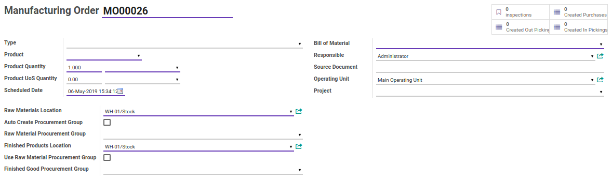

#### <a name="field-smart-button">Smart Button</a>

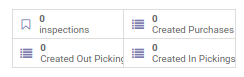 

Tombol-tombol yang berfungsi sebagai *Shortcut* untuk masuk ke dalam menu yang berkaitan dan juga sebagai pemberi informasi mengenai seberapa banyak data, total, dll  

#### <a name="field-number"># Manufacturing Order</a>

Nomor **_Manufacturing Order_**.

#### <a name="field-type">Type</a>

Mendefinisikan tipe dari **_Manufacturing Order_**.

#### <a name="field-product">Product</a>

Mendefinisikan produk jadi yang dihasilkan dari proses **_Manufacturing Order_**.

#### <a name="product-qty">Product Quantity</a>

* <a name="field-product-qty">**1.Quantity:** Mendefinisikan jumlah produk jadi yang dihasilkan dari proses **_Manufacturing Order_**.</a>
* <a name="field-product-qty-uom">**2.UoM:** Mendefinisikan satuan produk jadi yang dihasilkan dari proses **_Manufacturing Order_**.</a>

#### <a name="product-uos-qty">Product UoS Quantity</a>

* <a name="field-product-uos-qty">**1.Quantity:** Mendefinisikan jumlah produk jadi yang dihasilkan dari proses **_Manufacturing Order_**.</a>
* <a name="field-product-qty-uos">**2.UoS:** Mendefinisikan satuan produk jadi yang dihasilkan dari proses **_Manufacturing Order_**.</a>

#### <a name="field-scheduled-date">Scheduled Date</a>

Menjadwalkan tanggal proses **_Manufacturing Order_**.

#### <a name="field-bom">Bill of Material</a>

Mendefinisikan **_Bill of Material_**.

#### <a name="field-resposible">Responsible</a>

Mendefinisikan user yang bertanggung jawab terkait proses **_Manufacturing Order_**.

#### <a name="field-soruce-document">Source Document</a>

Mendefinisikan dokumen terkait proses **_Manufacturing Order_**.

#### <a name="field-operating-unit-ids">Operating Units</a>
> **Catatan:** Isian ini hanya untuk user yang memiliki group **Multi Operating Unit**

Mendefinisikan operating unit terkait proses **_Manufacturing Order_**.

#### <a name="field-project">Project</a>

Mendefinisikan projek terkait proses **_Manufacturing Order_**.

#### <a name="field-raw-materials-location">Raw Materials Location</a>

Mendefinisikan lokasi bahan baku yang akan digunakan

#### <a name="field-auto-create-procurement">Auto Create Procurement Group</a>

#TODO

#### <a name="field-raw-material-procurement">Raw Material Procurement Group</a>

#TODO

#### <a name="field-finished-products-location">Finished Products Location</a>

Mendefinisikan lokasi barang jadi yang akan digunakan

#### <a name="field-use-raw-procurement">Use Raw Material Procurement Group</a>

#TODO

#### <a name="field-finished-procurement">Finished Good Procurement Group</a>

#TODO

### <a name="tab-consumed-product">TAB CONSUMED PRODUCT</a>

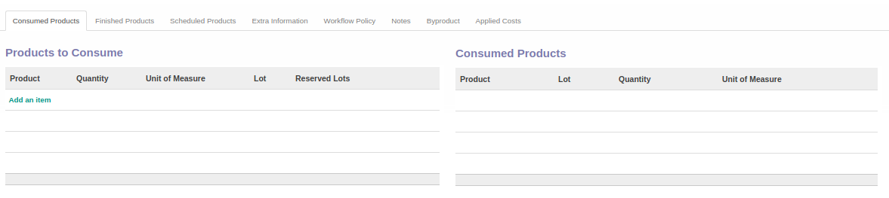

#### <a name="field-product-to-consumed">Products to Consume</a>

Mendefinisikan produk(**bahan baku**) **"yang akan digunakan"** untuk proses membuat produk(**barang jadi**).
Isian ini dapat diisi otomatis oleh Odoo berdasarkan [Bill of Material](./penjelasan.md#field-bom) yang dipilih atau menambahkannya secara manual dengan mengklik tombol **_Add an item_**

#### <a name="field-consumed-product">Consumed Products</a>

Mendefinisikan produk(**bahan baku**) **"yang sudah digunakan"** untuk proses membuat produk(**barang jadi**).

### <a name="tab-finished-product">TAB FINISHED PRODUCT</a>

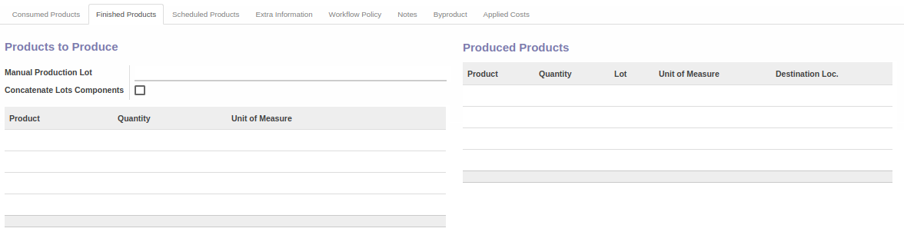

#### <a name="field-manual-production-lot">Manual Production Lot</a>

#TODO

#### <a name="field-concatenate-lots-components">Concatenate Lots Components</a>

#TODO

#### <a name="field-product-to-produce">Products to Produce</a>

Mendefinisikan produk(**barang jadi**) **"yang akan diproduksi"**.

#### <a name="field-produced-products">Produced Products</a>

Mendefinisikan produk(**barang jadi**) **"yang sudah diproduksi"**.

### <a name="tab-scheduled-product">TAB SCHEDULED PRODUCT</a>

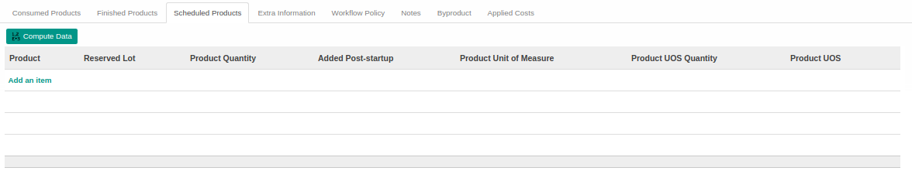
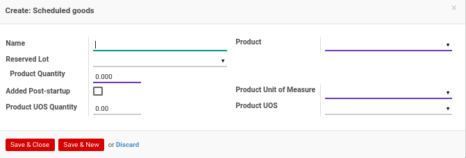

#### <a name="field-scheduled-name">Name</a>

Mendefinisikan nama *Scheduled Goods*

#### <a name="field-scheduled-product">Product</a>

Mendefinisikan produk *Scheduled Goods*

#### <a name="field-scheduled-reserved-lot">Reserved Lot</a>

#TODO

#### <a name="field-scheduled-product-qty">Product Quantity</a>

Mendefinisikan kuantitas produk *Scheduled Goods*

#### <a name="field-added-post-startup">Added Post-startup</a>

#TODO

#### <a name="field-scheduled-product-uom">Product Unit Of Measure</a>

Mendefinisikan satuan produk *Scheduled Goods*

#### <a name="field-scheduled-product-uos-qty">Product UoS Quantity</a>

Mendefinisikan kuantitas produk UoS *Scheduled Goods*

#### <a name="field-scheduled-product-uos">Product UoS</a>

Mendefinisikan produk UoS *Scheduled Goods*

### <a name="tab-extra-info">TAB EXTRA INFORMATION</a>

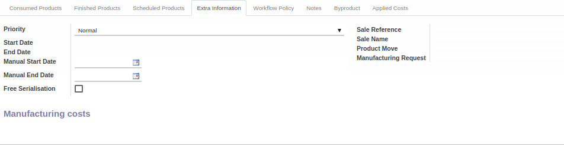

#### <a name="field-priority">Priority</a>

Mendefinisikan prioritas terkait proses **_Manufacturing Order_**

#### <a name="field-auto-start-date">Start Date</a>

Diisi otomatis oleh odoo. Mendefinisikan tanggal dimulainya proses **_Manufacturing Order_**

#### <a name="field-auto-end-date">End Date</a>

Diisi otomatis oleh odoo. Mendefinisikan tanggal berakhirnya proses **_Manufacturing Order_**

#### <a name="field-manual-start-date">Manual Start Date</a>

Mendefinisikan secara manual tanggal dimulainya proses **_Manufacturing Order_**

#### <a name="field-manual-end-date">Manual End Date</a>

Mendefinisikan secara manual tanggal berakhirnya proses **_Manufacturing Order_**

#### <a name="field-free-serialisation">Free Serialisation</a>

#TODO

#### <a name="field-sale-referensi">Sale Reference</a>

Mendefinisikan referensi penjualan

#### <a name="field-sale-name">Sale Name</a>

Mendefinisikan nama penjualan

#### <a name="field-product-move">Product Move</a>

Mendefinisikan pergerakan stock/produk

#### <a name="field-manufacturing-request">Manufacturing Request</a>

Mendefinisikan permintaan produksi

### <a name="tab-workflow-policy">TAB WORKFLOW POLICY</a>

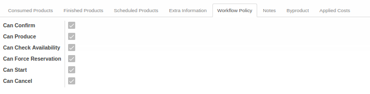

#### <a name="field-can-confirm">Can Confirm</a>

Diisi otomatis oleh Odoo. Jika aktif, maka user yang membuka data **_Manufacturing Order_** dapat melakukan [Konfirmasi Manufacturing Order](./konfirmasi.md).

#### <a name="field-can-produce">Can Produce</a>

Diisi otomatis oleh Odoo. Jika aktif, maka user yang membuka data **_Manufacturing Order_** dapat melakukan [Produksi Finished Goods](./produksi.md).

#### <a name="field-can-check-availability">Can Check Availability</a>

Diisi otomatis oleh Odoo. Jika aktif, maka user yang membuka data **_Manufacturing Order_** dapat melakukan [Cek Ketersediaan Raw Material](./cek-rm.md).

#### <a name="field-can-force-reservation">Can Force Reservation</a>

Diisi otomatis oleh Odoo. Jika aktif, maka user yang membuka data **_Manufacturing Order_** dapat melakukan **_Force Reservation_**

#### <a name="field-can-start">Can Start</a>

Diisi otomatis oleh Odoo. Jika aktif, maka user yang membuka data **_Manufacturing Order_** dapat melakukan [Memulai Manufacturing Order](./mulai.md).

#### <a name="field-can-cancel">Can Cancel</a>

Diisi otomatis oleh Odoo. Jika aktif, maka user yang membuka data **_Manufacturing Order_** dapat melakukan [Membatalkan Manufacturing Order](./batal.md).

### <a name="tab-notes">TAB NOTES</a>

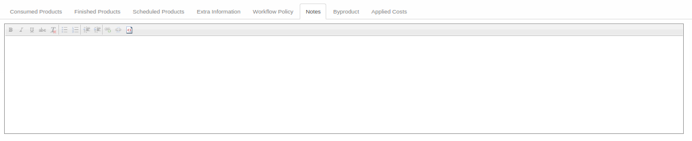

#### <a name="field-notes">Notes</a>

Catatan/Informasi tambahan terkait **_Manufacturing Order_**

### <a name="tab-byproduct">TAB BYPRODUCT</a>

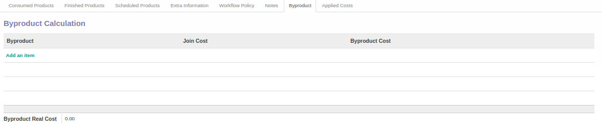
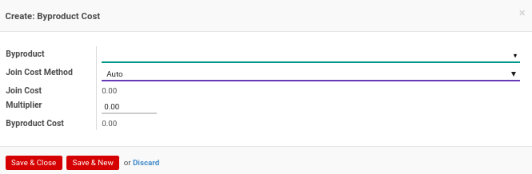

#### <a name="field-byproduct">Byproduct</a>

#TODO

#### <a name="field-join-cost-method">Join Cost Method</a>

#TODO

#### <a name="field-join-cost">Join Cost</a>

#TODO

#### <a name="field-multiplier">Multiplier</a>

#TODO

#### <a name="field-byproduct-cost">Byproduct Cost</a>

#TODO

### <a name="tab-applied-cost">TAB APPLIED COST</a>

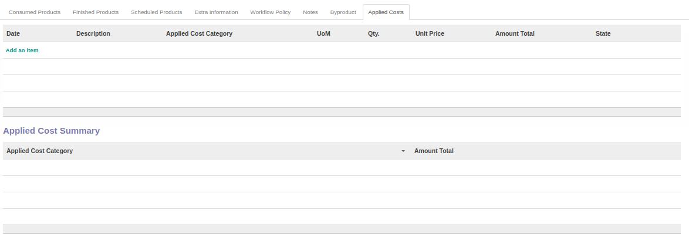
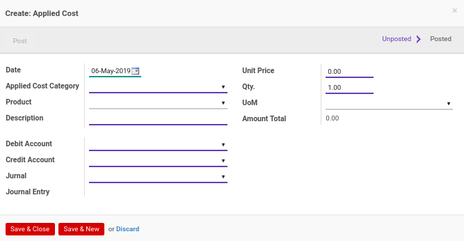

#### <a name="field-applied-cost-date">Date</a>

Mendefinisikan tanggal *Applied Cost*

#### <a name="field-applied-categ-date">Applied Cost Category</a>

Mendefinisikan kategori *Applied Cost*

#### <a name="field-applied-categ-product">Product</a>

Mendefinisikan produk *Applied Cost*

#### <a name="field-applied-categ-description">Description</a>

Mendefinisikan deskripsi *Applied Cost*

#### <a name="field-applied-categ-unit-price">Unit Price</a>

Mendefinisikan harga satuan *Applied Cost*

#### <a name="field-applied-categ-qty">Qty.</a>

Mendefinisikan kuantitas *Applied Cost*

#### <a name="field-applied-categ-uom">UoM</a>

Mendefinisikan satuan *Applied Cost*

#### <a name="field-amount-total">UoM</a>

Menginformasikan total *Applied Cost*

#### <a name="field-debit-acc">Debit Account</a>

Mendefinisikan akun debet

#### <a name="field-credit-acc">Debit Account</a>

Mendefinisikan akun kredit

#### <a name="field-jurnal">Jurnal</a>

Mendefinisikan jurnal yang digunakan

#### <a name="field-jurnal-entry">Joernal Entry</a>

Mendefinisikan entri jurnal 
