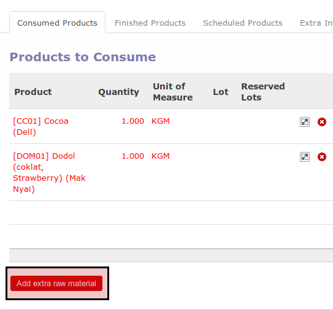
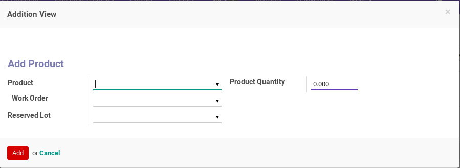
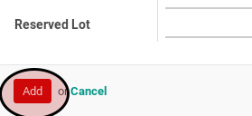

# Menambahkan Raw Material

## A. INPUT

* Data manufacturing order yang akan dikonfirmasi harus memiliki status **New** atau **Awaiting Raw Material** atau **Production Started**.

## B. LANGKAH KERJA

1. Buka menu **Manfacturing -> Manufacturing -> Manufacturing Order**. Abaikan jika sudah berada pada menu yang dimaksud.
2. Buka data manufacturing order yang akan ditambahkan raw material. Abaikan jika data sudah terbuka.
3. Buka tab **Consumed Product**.
4. <a name="l4">Klik</a> tombol **Add extra raw material** pada bagian bawah tabel **Products To Consume**

5. Pop-up **Addition View** akan muncul.

6. Pilih **Product** pada pop-up **Addition View**. Harus diisi.
7. Isi **Quantity** pada pop-up **Addition View**. Harus diisi.
8. Klik tombol **Add** pada bagian bawah-kiri pop-up **Addition View**

9. Ulangi [langkah ke-4](#l4) untuk setiap bahan baku yang akan ditambahkan.

## C. OUTPUT

*(Tidak ada instruksi khusus)*
